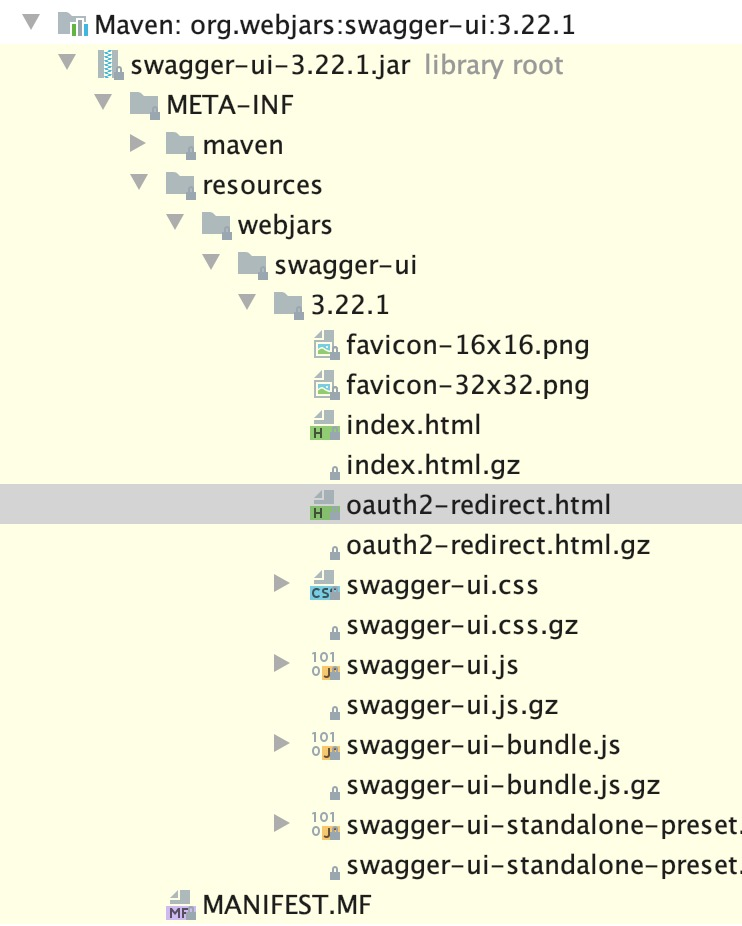

# Overview

Developing WebFlux based service I encountered on SpringFox integration issue. I simply cannot expose SwaggerUI
in my service. The service used netty and reactor for requests handling and implemented a contract described in OpenAPI.

At first I thought that I can introduced changes within SprigFox, but on the second thought I've realized that
SwaggerUI is purely client based and a server is rather required to host static file.

# WebJars

I've started looking for statically packaged SwaggerUI and found [webjars.org](https://www.webjars.org) web page.
It looked like a perfect fit.

> **WebJars are client-side web libraries (e.g. jQuery & Bootstrap) packaged into JAR (Java Archive) files.**

> * Explicitly and easily manage the client-side dependencies in JVM-based web applications
> * Use JVM-based build tools (e.g. Maven, Gradle, sbt, ...) to download your client-side dependencies
> * Know which client-side dependencies you are using
> * Transitive dependencies are automatically resolved and optionally loaded via RequireJS
> * Deployed on Maven Central
> * Public CDN, generously provided by:      

I've put swagger-ui in the search box presented located on [webjars.org](https://www.webjars.org) web page and... yeah
[swagger-ui](https://github.com/webjars/swagger-ui) was there. Thanks [jamesward](https://github.com/jamesward) for 
packaging and exposing swagger-ui to others :)

The packaged static part part was covered. Since the package is a java library available in maven public repositories
I could add it as a yet another dependency to the project.

# Integration

Yet another dependency in maven is a piece of cake :)  Done plenty of times.
```xml
<dependency>
    <groupId>org.webjars</groupId>
    <artifactId>swagger-ui</artifactId>
</dependency>
``` 

The hard part was about to begin. I've started to think - how to expose static resources in WebFlux?

I thought that webflux configuration could be a good starting point and looked at its configuration's source code.
First step - annotation `EnableWebFlux`. 

```java
@Retention(RetentionPolicy.RUNTIME)
@Target(ElementType.TYPE)
@Documented
@Import(DelegatingWebFluxConfiguration.class)
public @interface EnableWebFlux {
}
```

Fortunately for me the handling bean's configuration was there in the import declaration: `DelegatingWebFluxConfiguration.class`
I started to read the code:
```java 
/**
 * A subclass of {@code WebFluxConfigurationSupport} that detects and delegates
 * to all beans of type {@link WebFluxConfigurer} allowing them to customize the
 * configuration provided by {@code WebFluxConfigurationSupport}. This is the
 * class actually imported by {@link EnableWebFlux @EnableWebFlux}.
 *
 * @author Brian Clozel
 * @since 5.0
 */
@Configuration
public class DelegatingWebFluxConfiguration extends WebFluxConfigurationSupport {

	private final WebFluxConfigurerComposite configurers = new WebFluxConfigurerComposite();

	@Autowired(required = false)
	public void setConfigurers(List<WebFluxConfigurer> configurers) {
		if (!CollectionUtils.isEmpty(configurers)) {
			this.configurers.addWebFluxConfigurers(configurers);
		}
	}

	@Override
	protected void configureContentTypeResolver(RequestedContentTypeResolverBuilder builder) {
		this.configurers.configureContentTypeResolver(builder);
	}

	@Override
	protected void addCorsMappings(CorsRegistry registry) {
		this.configurers.addCorsMappings(registry);
	}

	@Override
	public void configurePathMatching(PathMatchConfigurer configurer) {
		this.configurers.configurePathMatching(configurer);
	}

	@Override
	protected void addResourceHandlers(ResourceHandlerRegistry registry) {
		this.configurers.addResourceHandlers(registry);
	}

	@Override
	protected void configureArgumentResolvers(ArgumentResolverConfigurer configurer) {
		this.configurers.configureArgumentResolvers(configurer);
	}

	@Override
	protected void configureHttpMessageCodecs(ServerCodecConfigurer configurer) {
		this.configurers.configureHttpMessageCodecs(configurer);
	}

	@Override
	protected void addFormatters(FormatterRegistry registry) {
		this.configurers.addFormatters(registry);
	}

	@Override
	protected Validator getValidator() {
		Validator validator = this.configurers.getValidator();
		return (validator != null ? validator : super.getValidator());
	}

	@Override
	protected MessageCodesResolver getMessageCodesResolver() {
		MessageCodesResolver messageCodesResolver = this.configurers.getMessageCodesResolver();
		return (messageCodesResolver != null ? messageCodesResolver : super.getMessageCodesResolver());
	}

	@Override
	protected void configureViewResolvers(ViewResolverRegistry registry) {
		this.configurers.configureViewResolvers(registry);
	}
}
```

`WebFluxConfigurer` - looked as suspiciously good hit. I went inside and... bang. 
The method: `addResourceHandlers` just asked me: wanna exposed any static resource?

I quickly created a test to verify whether I'll expose swagger-ui in the path - `/documentations/swagger-ui/index.html`:
```java 
@AutoConfigureWebTestClient
@ExtendWith(BlockHoundExtension.class)
@SpringBootTest(webEnvironment = SpringBootTest.WebEnvironment.MOCK, classes = Application.class)
class SwaggerUITest {

    @Test
    void exposesSwaggerUI() {
        // when
        webClient.get().uri("/documentations/swagger-ui/index.html")
                .exchange()
                .expectStatus().isOk();
    }

    @Autowired
    private WebTestClient webClient;
}
```   

No wonder first test launch was red. I didn't expose any resource, yet. The resource configuration was
pretty straightforward: 
```java
@Configuration
@RequiredArgsConstructor(onConstructor = @__(@Autowired))
class SwaggerUIConfiguration implements WebFluxConfigurer {

    private final Environment environment;

    @Bean
    WebJarAssetLocator webJarAssetLocator() {
        return new WebJarAssetLocator();
    }

    @Bean
    WebJarsResourceResolver webJarsResourceResolver() {
        return new WebJarsResourceResolver(webJarAssetLocator());
    }

    @Override
    public void addResourceHandlers(ResourceHandlerRegistry registry) {
        final var cachedIfNotLocalEnvironment = !ArrayUtils.contains(environment.getActiveProfiles(), "local");
        registry
                .addResourceHandler("/documentations/**")
                .addResourceLocations(
                        "classpath:/documentations/",
                        "classpath:/META-INF/resources/webjars/",
                        "classpath:/specs/")
                .resourceChain(cachedIfNotLocalEnvironment)
                .addResolver(webJarsResourceResolver());
    }

}
```

Straightforward, you say?

Yeah, it was tough. I got pretty half an hour of hard time to figure out, how to deal with a webjar's content.
WebJar structure looks like that:


The url path, if nothing would be done, would look like: `/documentations/webjars/swagger-ui/3.22.1/index.html`
`/documentations` - is from `.addResourceHandler("/documentations/**")`, rest is from the location of webjar's resources.

My first thought was to write a custom resolver that would take care about webjar structure and skip not relevant parts.
There were issues like:
* resource name - `swagger-ui` which must be provided,
* resource version - `3.22.1` must be provided as well.

Writing a custom resolver isn't tough job to perform, still perhaps someone already wrote it - the webjar structure
looks like something that can be tackled by a generic resolver. I googled this time and found:
```xml
<dependency>
    <groupId>org.webjars</groupId>
    <artifactId>webjars-locator-core</artifactId>
</dependency>
```

I used aforementioned snippet to extend maven `pom.xml`, added resolver `.addResolver(webJarsResourceResolver()`
and ran `SwaggerUITest`.

This time it was green.